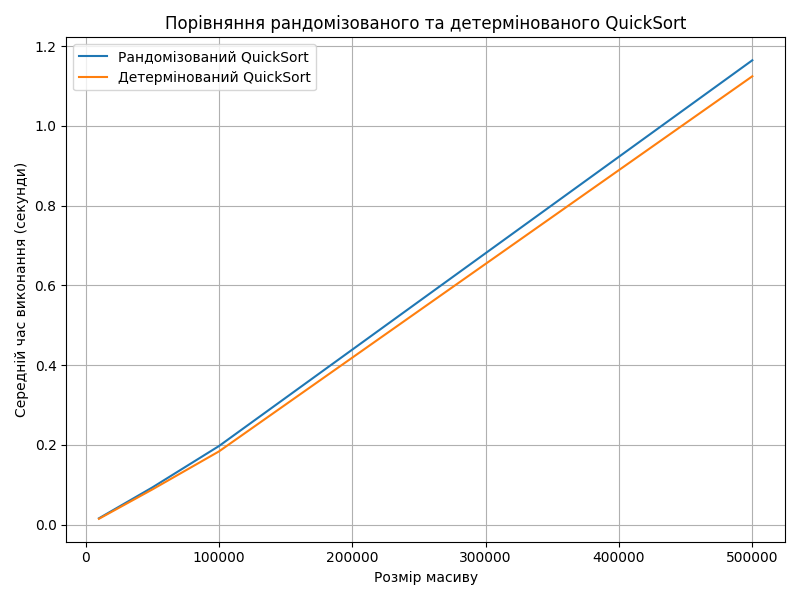

# goit-algo2-hw-10

## task 1
Розмір масиву: 10000

Рандомізований QuickSort: 0.0156 секунд

Детермінований QuickSort: 0.0143 секунд

Розмір масиву: 50000

Рандомізований QuickSort: 0.0929 секунд

Детермінований QuickSort: 0.0879 секунд

Розмір масиву: 100000

Рандомізований QuickSort: 0.1969 секунд

Детермінований QuickSort: 0.1834 секунд

Розмір масиву: 500000

Рандомізований QuickSort: 1.1648 секунд

Детермінований QuickSort: 1.1247 секунд

## task 2

Розклад занять:

Наталія Шевченко, 29 років, email: n.shevchenko@example.com

Викладає предмети: Біологія, Хімія

Дмитро Бондаренко, 35 років, email: d.bondarenko@example.com

Викладає предмети: Інформатика, Фізика

Олександр Іваненко, 45 років, email: o.ivanenko@example.com

Викладає предмети: Математика